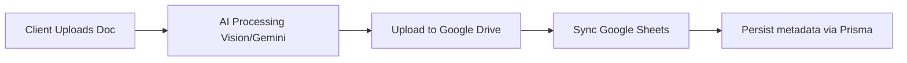

<div align="center">
  <h1>Platform Migratory API</h1>
  <p><b>Streamlining legal immigration processes through AI-powered document validation and seamless Google Workspace integration.</b></p>

  <a href="https://nodejs.org/">
    
  </a>
  <a href="https://www.typescriptlang.org/">
    
  </a>
  <a href="https://expressjs.com/">
    
  </a>
  <a href="https://www.prisma.io/">
    
  </a>
  <a href="https://supabase.com/">
    
  </a>
  <a href="https://render.com/">
    
  </a>
</div>

---

## Table of Contents

* [Features](#features)
* [Architecture & AI Flow](#architecture--ai-flow)
* [Folder Structure](#folder-structure)
* [Getting Started](#getting-started)
* [Running the Application](#running-the-application)
* [Deployment (Render + Supabase)](#deployment-render--supabase)
* [Google OAuth Cutover Checklist](#google-oauth-cutover-checklist)
* [Contributing](#contributing)
* [License](#license)

---

## Features

* **Dual-Role Authentication:** Secure access for `Clients` and `Lawyers`.
* **AI Document Validation:** Google Vision API + Gemini AI.
* **Automated Storage Pipeline:** Google Drive for document storage.
* **Real-time Syncing:** Client statuses and validations in Google Sheets.
* **Family Nucleus Management:** Group interconnected migratory applications.

---

## Architecture & AI Flow

Layered architecture: Routes → Controllers → Services.



- **Identity / ops DB:** PostgreSQL on Supabase (Prisma)
- **Case data:** Google Sheets
- **Files:** Google Drive
- **Hosting:** Render Web Service

---

## Folder Structure

```plaintext
platform-migratory-backend/
├── prisma/                  # Schema + PostgreSQL migrations
├── src/
│   ├── config/              # Google APIs, Prisma client
│   ├── controllers/
│   ├── middleware/
│   ├── models/
│   ├── routes/
│   ├── services/
│   │   ├── ai/              # Gemini and Vision
│   │   ├── googleDrive/
│   │   └── googleSheets/
│   ├── utils/
│   ├── app.ts
│   └── index.ts
├── tests/
├── .env.example
└── README.md
```

---

## Getting Started

### Prerequisites

* Node.js 18+
* Access to a Supabase PostgreSQL database (or local Postgres)
* Google Cloud project with Drive, Sheets, Vision APIs enabled (APIs only; hosting is on Render)
* Gemini API key
* Resend API key (email)

### Installation

```bash
git clone https://github.com/Jonathanrbt/platform-migratory-backend.git
cd platform-migratory-backend
npm install
```

### Environment Variables

```bash
cp .env.example .env
```

Configure at least:

| Variable | Purpose |
|---|---|
| `JWT_SECRET` | Auth tokens |
| `DATABASE_URL` | Supabase transaction pooler (`:6543`, `pgbouncer=true`) |
| `DIRECT_URL` | Supabase session pooler (`:5432`) for Prisma migrations |
| `GOOGLE_*` | Service account + OAuth + Drive/Sheets IDs |
| `GEMINI_API_KEY` | AI validation |
| `FRONTEND_URL` | CORS + post-login redirects (Vercel in production) |
| `GOOGLE_REDIRECT_URI` | Backend OAuth callback URL |
| `RESEND_API_KEY` / `SMTP_FROM` | Email |

See `.env.example` for full comments.

### Database Setup (Prisma)

```bash
npx prisma generate
npx prisma migrate deploy   # production / CI
# OR for local iteration:
npx prisma migrate dev
```

Production start already runs `prisma migrate deploy` before the server boots.

---

## Administrative Tasks

### Create a Lawyer User

```bash
npx ts-node src/scripts/create_lawyer.ts
```

Edit the script credentials as needed before running.

---

## Running the Application

```bash
npm run dev      # development
npm run build    # prisma generate + tsc
npm start        # migrate deploy + node dist/index.js
```

Health check: `GET /health`

---

## Deployment (Render + Supabase)

### Supabase

1. Project: `platformigratory` (PostgreSQL, West EU).
2. Use **pooler** connection strings (IPv4-friendly):
   - `DATABASE_URL` → transaction mode port `6543`
   - `DIRECT_URL` → session mode port `5432`
3. Apply schema with `npx prisma migrate deploy` (also runs on Render boot).

Supabase Auth / Storage / RLS are **not** used; Prisma owns the schema.

### Render

1. Web Service connected to this GitHub repo.
2. Build: `npm install && npm run build`
3. Start: `npm start`
4. Region: Frankfurt (EU). Prefer **Starter** (paid) so the service does not sleep; Free works but cold starts can break OAuth mid-flow.
5. Set all production env vars from `.env.example` (values from your secrets store).
6. Production URL (current): `https://platform-migratory-backend.onrender.com`
7. After deploy, set / verify:
   - `GOOGLE_REDIRECT_URI=https://platform-migratory-backend.onrender.com/api/v1/auth/google/callback`
   - `FRONTEND_URL=https://<app>.vercel.app` (update when the frontend moves off Cloud Run)

---

## Google OAuth Cutover Checklist

OAuth lives in **Google Cloud Console → APIs & Services → Credentials** (not on Cloud Run). Hosting can move; the OAuth client stays.

1. Deploy backend on Render and note the public HTTPS URL.
2. In the OAuth 2.0 Web Client:
   - **Authorized redirect URIs:** add  
     `https://<backend>.onrender.com/api/v1/auth/google/callback`  
     (remove old `*.run.app` callback when cutover is done).
   - **Authorized JavaScript origins:** add Vercel origin  
     `https://<frontend>.vercel.app` (+ `http://localhost:5173` for local).
3. Set Render env:
   - `GOOGLE_REDIRECT_URI` = exact callback URI from step 2
   - `FRONTEND_URL` = exact Vercel origin (CORS is origin-exact)
4. Point the frontend API base URL to the Render backend.
5. Smoke test: open `/api/v1/auth/google/url` → Google consent → land on `/login/success?token=...`.

**Common failures**

| Symptom | Cause |
|---|---|
| `redirect_uri_mismatch` | Console URI ≠ `GOOGLE_REDIRECT_URI` |
| CORS errors | `FRONTEND_URL` ≠ browser origin |
| CSRF / missing `oauth_state` | Callback not on HTTPS / cookie blocked |

Drive, Sheets, Vision, and Gemini credentials do **not** change with this hosting move.

---

## Contributing

We use Husky, lint-staged, ESLint, and Prettier.

```text
feat: add new gemini extraction service
fix: resolve memory leak in multer upload
docs: update setup instructions
```

```bash
npm run lint
npm run format
```

---

## License

This project is proprietary and confidential. Unauthorized copying of these files, via any medium, is strictly prohibited.

<p align="center">Made for a better migratory experience.</p>
